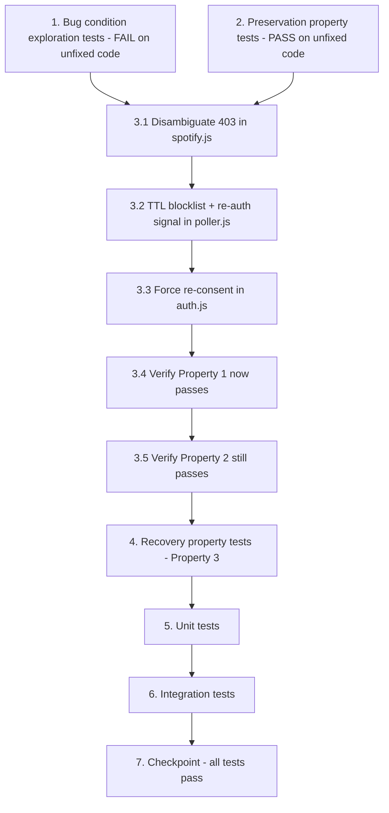

# Implementation Plan

## Overview

This plan fixes two compounding defects that cause editable, user-owned playlists to silently and permanently stop being cleaned: (1) generic `403 "Forbidden"` responses are misclassified as `FORBIDDEN_PLAYLIST` instead of `MISSING_SCOPE`, and (2) the in-memory blocklist is permanent with no recovery path. It follows the exploratory bugfix workflow: write a failing bug-condition test and passing preservation tests on the unfixed code, apply the three-part fix across `spotify.js`, `poller.js`, and `auth.js`, then validate fix, preservation, and recovery behavior with property-based and integration tests.

## Tasks

- [x] 1. Write bug condition exploration tests
  - **Property 1: Bug Condition** - Editable-playlist 403 is treated as missing scope, not blocklisted
  - **CRITICAL**: These tests MUST FAIL on unfixed code - failure confirms the bug exists
  - **DO NOT attempt to fix the test or the code when it fails**
  - **NOTE**: These tests encode the expected behavior - they will validate the fix when they pass after implementation
  - **GOAL**: Surface counterexamples that demonstrate the bug and confirm/refute root causes (message-only 403 classification; permanent blocklist)
  - **Scoped PBT Approach**: For the deterministic 403-classification defect, scope the property to concrete failing cases (generic `403 "Forbidden"` on an editable playlist) for reproducibility; vary owner/collaborative combos and arbitrary non-`insufficient client scope` messages
  - In `src/__tests__/spotify.test.js`, follow the existing Vitest + fast-check + `vi.mock('axios')` pattern:
    - Mock `axios.delete` to reject with `403 { error: { status: 403, message: "Forbidden" } }` and mock the playlist lookup (`GET /playlists/{id}`) so the playlist is owned by the authenticated user (`owner.id === authUserId`). Call the UNFIXED `removeTrackFromPlaylist(accessToken, playlistId, trackUri, authUserId)` and assert `err.code === 'MISSING_SCOPE'`
    - Repeat with `collaborative === true` and a different `owner.id`; assert `err.code === 'MISSING_SCOPE'`
  - In `src/__tests__/poller.test.js`, drive `removeTrack` with a `FORBIDDEN_PLAYLIST` error and assert (a) the playlist is added to `forbiddenPlaylists` with no expiry/recovery mechanism, and (b) no re-auth signal is recorded for the user
  - The test assertions encode the Expected Behavior Properties from the design: classify `MISSING_SCOPE`, do NOT blocklist, record a durable re-auth signal
  - Run tests on UNFIXED code
  - **EXPECTED OUTCOME**: Tests FAIL (this is correct - generic `403 "Forbidden"` on an editable playlist is classified `FORBIDDEN_PLAYLIST`, the playlist is permanently blocklisted, and no re-auth signal exists)
  - Document counterexamples found (e.g. "`removeTrackFromPlaylist` returns `FORBIDDEN_PLAYLIST` for owned playlist `44mvOQyxuqicfjBpwIQYcb`; `forbiddenPlaylists` Set retains it permanently with no TTL")
  - Mark task complete when tests are written, run, and failures are documented
  - _Requirements: 1.1, 1.2, 1.3, 1.4_

- [x] 2. Write preservation property tests (BEFORE implementing fix)
  - **Property 2: Preservation** - Non-bug 403s and all other outcomes are unchanged
  - **IMPORTANT**: Follow observation-first methodology - observe behavior on UNFIXED code first, then write property-based tests asserting those observed outcomes
  - **Why property-based**: preservation is a universal property ("for all non-bug inputs"); fast-check generators cover the full domain (HTTP statuses, message strings, ownership/collaborative combos, blocklist states) and catch edge cases manual tests miss
  - In `src/__tests__/spotify.test.js` and `src/__tests__/poller.test.js`, write fast-check properties over non-bug inputs:
    - `insufficient client scope` 403 → observe `MISSING_SCOPE` on unfixed code; assert unchanged (Req 3.1)
    - Successful (2xx) removal → observe `removal_log` insert and no blocklist; assert unchanged (Req 3.2)
    - Non-403 errors generated across {404, 429-after-retries-exhausted, 5xx, network/timeout} → observe log + skip + no blocklist; assert unchanged (Req 3.3)
    - Genuine non-editable 403 (`owner.id !== authUserId` and `collaborative === false`) → observe `FORBIDDEN_PLAYLIST` + blocklisted; assert still `FORBIDDEN_PLAYLIST` and the Spotify removal call is skipped while the entry is active (Req 3.4, 3.5)
  - Run tests on UNFIXED code
  - **EXPECTED OUTCOME**: Tests PASS (this confirms the baseline behavior to preserve)
  - Mark task complete when tests are written, run, and passing on unfixed code
  - _Requirements: 3.1, 3.2, 3.3, 3.4, 3.5_

- [x] 3. Fix for 403 misclassification and over-sticky blocklist

  - [x] 3.1 Disambiguate the 403 in `removeTrackFromPlaylist` (`src/lib/spotify.js`)
    - Add an optional `authUserId` parameter (last positional arg) so existing call shapes degrade gracefully
    - Preserve the `insufficient client scope` short-circuit: if the 403 body message matches `/insufficient client scope/i`, throw `MISSING_SCOPE` exactly as today (no playlist lookup)
    - For a generic 403 (non-matching message), issue a write-capability probe `GET /playlists/{playlistId}?fields=owner(id),collaborative` via the existing rate-limit-aware GET helper, then compute `isEditable = (owner.id === authUserId) || (collaborative === true)`
    - If `isEditable` is `true` → throw `MISSING_SCOPE`; if `false` → throw `FORBIDDEN_PLAYLIST`
    - Fail safe: if the probe fails (network/404/`authUserId` unavailable), default to `MISSING_SCOPE` and log the probe failure for observability
    - _Bug_Condition: isBugCondition(input) = httpStatus == 403 AND NOT matches(bodyMessage, /insufficient client scope/i) AND ((playlistOwnerId == authUserId) OR collaborative)_
    - _Expected_Behavior: classify MISSING_SCOPE for editable-playlist 403s; FORBIDDEN_PLAYLIST only for non-editable; fail-safe MISSING_SCOPE on probe failure_
    - _Preservation: insufficient-client-scope 403, 2xx success, non-403 errors, and non-editable 403 paths unchanged_
    - _Requirements: 2.1, 3.1_

  - [x] 3.2 Add TTL blocklist + re-auth signal and update `removeTrack` (`src/lib/poller.js`)
    - Convert exported `forbiddenPlaylists` from `Set<playlistId>` to `Map<playlistId, expiresAtEpochMs>`
    - Add helper `isPlaylistBlocked(playlistId)`: returns `true` only if an entry exists and `Date.now() < expiresAt`; if expired, delete the entry and return `false` (lazy eviction)
    - Add helper `blockPlaylist(playlistId)`: sets `expiresAt = Date.now() + BLOCKLIST_TTL_MS` (default 6 hours)
    - Add exported `usersNeedingReauth` `Set<userId>` as the durable re-auth signal store
    - Update `removeTrack` 403 handling: thread `authUserId` into `removeTrackFromPlaylist`; replace `forbiddenPlaylists.has(...)` with `isPlaylistBlocked(...)`; on `FORBIDDEN_PLAYLIST` call `blockPlaylist(playlistId)` and log; on `MISSING_SCOPE` do NOT blocklist, add `userId` to `usersNeedingReauth` and log the re-auth requirement
    - Thread `authUserId`/`spotify_id` through the call chain: add `spotify_id` to the `runPollCycle` user `select(...)` and pass it down through `detectSkip → removeTrack → removeTrackFromPlaylist`
    - In `registerUser` (called on successful re-auth from the auth callback), clear the user from `usersNeedingReauth` and drop their blocklist entries
    - Leave the success path and non-403 error path untouched
    - _Bug_Condition: MISSING_SCOPE result from removeTrackFromPlaylist for an editable-playlist 403_
    - _Expected_Behavior: MISSING_SCOPE → no blocklist + usersNeedingReauth.add(userId); FORBIDDEN_PLAYLIST → blockPlaylist with future expiresAt; re-auth clears state_
    - _Preservation: success-path removal_log write, non-403 skip, and active-blocklist skip unchanged_
    - _Requirements: 2.2, 2.3, 2.4, 3.2, 3.3, 3.4, 3.5_

  - [x] 3.3 Force re-consent for stale-token users (`src/routes/auth.js`)
    - Keep the requested `SCOPES` list unchanged (already correct - the defect is stale tokens, not a missing scope)
    - Set/document `show_dialog: 'true'` for the re-auth flow (or trigger re-auth for users present in `usersNeedingReauth`) so a user with a stale, scope-less token is re-prompted and a new token with write scope is minted
    - _Bug_Condition: stale token lacking playlist-modify scope never forced to re-consent_
    - _Expected_Behavior: re-auth flow re-prompts and mints a token with write scope_
    - _Preservation: scope list and normal first-time auth flow unchanged_
    - _Requirements: 2.3_

  - [x] 3.4 Verify bug condition exploration tests now pass
    - **Property 1: Expected Behavior** - Editable-playlist 403 is treated as missing scope, not blocklisted
    - **IMPORTANT**: Re-run the SAME tests from task 1 - do NOT write new tests
    - The tests from task 1 encode the expected behavior; when they pass they confirm it is satisfied
    - Run the bug condition exploration tests from task 1
    - **EXPECTED OUTCOME**: Tests PASS (editable-playlist 403 → `MISSING_SCOPE`, not blocklisted, `usersNeedingReauth` records the user)
    - _Requirements: 2.1, 2.2, 2.3_

  - [x] 3.5 Verify preservation tests still pass
    - **Property 2: Preservation** - Non-bug 403s and all other outcomes are unchanged
    - **IMPORTANT**: Re-run the SAME tests from task 2 - do NOT write new tests
    - Run the preservation property tests from task 2
    - **EXPECTED OUTCOME**: Tests PASS (confirms no regressions)
    - Confirm all tests still pass after the fix
    - _Requirements: 3.1, 3.2, 3.3, 3.4, 3.5_

- [x] 4. Write recovery property tests
  - **Property 3: Recovery** - Blocklist entries are not permanent
  - **Why property-based**: recovery is a universal property over insertion times ("an entry is blocked iff `now < expiresAt`"); fast-check generators exercise many TTL/clock combinations
  - In `src/__tests__/poller.test.js`, write fast-check properties using fake timers / controlled `Date.now()`:
    - Generate blocklist entries with varied insertion times and assert `isPlaylistBlocked(playlistId)` returns `true` iff `now < expiresAt`, and that an expired entry is evicted (lazily deleted) and becomes retryable
    - Assert `blockPlaylist` sets `expiresAt = now + BLOCKLIST_TTL_MS`
    - Assert a successful re-auth via `registerUser` clears the user from `usersNeedingReauth` and drops their blocklist entries
  - **EXPECTED OUTCOME**: Tests PASS on fixed code (recovery path exists)
  - _Requirements: 2.4_

- [x] 5. Write unit tests for the fix
  - `removeTrackFromPlaylist` (`src/__tests__/spotify.test.js`): 403 generic message + owned playlist → `MISSING_SCOPE`; 403 generic + collaborative → `MISSING_SCOPE`; 403 generic + non-editable → `FORBIDDEN_PLAYLIST`; 403 `insufficient client scope` → `MISSING_SCOPE`; editability probe failure → fail-safe `MISSING_SCOPE`
  - `removeTrack` (`src/__tests__/poller.test.js`): `MISSING_SCOPE` → no blocklist, user added to `usersNeedingReauth`, no `removal_log` write; `FORBIDDEN_PLAYLIST` → blocklisted with a future `expiresAt`, no `removal_log` write
  - Blocklist helpers: `isPlaylistBlocked` returns `false` for expired entries and evicts them; `blockPlaylist` sets `expiresAt = now + TTL`
  - Run tests; all must pass on fixed code
  - _Requirements: 2.1, 2.2, 2.3, 2.4, 3.1, 3.2, 3.3, 3.4, 3.5_

- [x] 6. Write integration tests for the full poll cycle
  - Stale-token user whose owned playlist returns generic `403 "Forbidden"`: assert the playlist is NOT blocklisted, the user is flagged in `usersNeedingReauth`, and cleaning resumes after a simulated re-auth (`registerUser`) clears the signal
  - Genuine Spotify-owned (non-editable) playlist: assert it is blocklisted, skipped while the entry is active, and retried after the TTL elapses (advance fake timers past `BLOCKLIST_TTL_MS`)
  - Re-auth flow via `auth.js` callback → `registerUser` clears `usersNeedingReauth` and the user's blocklist entries
  - Run tests; all must pass on fixed code
  - _Requirements: 2.1, 2.2, 2.3, 2.4, 3.4, 3.5_

- [x] 7. Checkpoint - Ensure all tests pass
  - Run the full backend test suite (`npm test` / Vitest in single-run mode) and confirm every test passes
  - Confirm bug condition tests (task 1) pass, preservation tests (task 2) still pass, and recovery tests (task 4) pass
  - Ensure all tests pass, ask the user if questions arise

## Task Dependency Graph

```json
{
  "waves": [
    { "wave": 1, "tasks": ["1", "2"], "dependsOn": [] },
    { "wave": 2, "tasks": ["3.1"], "dependsOn": ["1", "2"] },
    { "wave": 3, "tasks": ["3.2"], "dependsOn": ["3.1"] },
    { "wave": 4, "tasks": ["3.3"], "dependsOn": ["3.2"] },
    { "wave": 5, "tasks": ["3.4"], "dependsOn": ["3.3"] },
    { "wave": 6, "tasks": ["3.5"], "dependsOn": ["3.4"] },
    { "wave": 7, "tasks": ["4"], "dependsOn": ["3.5"] },
    { "wave": 8, "tasks": ["5"], "dependsOn": ["4"] },
    { "wave": 9, "tasks": ["6"], "dependsOn": ["5"] },
    { "wave": 10, "tasks": ["7"], "dependsOn": ["6"] }
  ]
}
```



## Notes

- Tasks 1 and 2 MUST be completed on the UNFIXED code before any implementation: task 1 tests must FAIL (confirming the bug) and task 2 tests must PASS (establishing the preservation baseline).
- The three-part fix (3.1 spotify.js, 3.2 poller.js, 3.3 auth.js) is applied as one logical change; tasks 3.4 and 3.5 re-run the existing tests from tasks 1 and 2 rather than writing new ones.
- Property-based tests (fast-check) cover Property 2 (preservation) and Property 3 (recovery); follow the existing Vitest + `vi.mock('axios')` patterns in `src/__tests__/spotify.test.js` and `poller.test.js`.
- `forbiddenPlaylists` changes type from `Set<playlistId>` to `Map<playlistId, expiresAtEpochMs>` but keeps its exported name so existing introspection/tests continue to resolve it.
- The re-auth signal (`usersNeedingReauth`) and blocklist are in-memory, consistent with the current poller architecture; no DB migration is required.
